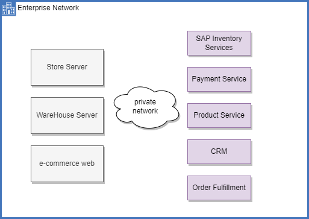
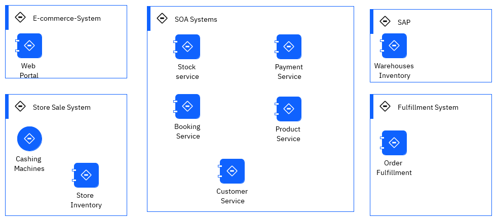

# Real-time inventory within an event-driven architecture

## What you will learn

* Use Quarkus, with reactive programming API like Mutiny, and Kafka API to produce messages to Kafka
* Same Quarkus app can generate messages to RabbitMQ using the AMQP API
* Same Quarkus app can generate messages to IBM MQ using JMS
* Use Quarkus and Kafka Streams to compute aggregates to build an inventory view from the stream of sale order events
* Use Apache Kafka,and Kafka Connector

As a developer you will use Microprofile reactive messaging, Apache Kafka, Kafka Streams API, Quarkus.

## Use Case Overview

Many companies managing product inventory today face significant challenges in achieving a near real-time view of item availability and a comprehensive global inventory perspective. Implementing effective solutions can be complex, especially when integrating Enterprise Resource Planning systems with custom legacy platforms. The following diagram is a high level view of the IT classical deployment of inventory mangagement solution:

New solutions are increasingly utilizing events as a data exchange source to reduce the load on existing ERP servers and enhance visibility into inventory levels. This approach also fosters agility in developing new solutions with streaming components.

The current scenario, in this repository, presents a straightforward near real-time inventory management solution, drawing from actual MVPs we developed in 2020 for various clients. The demonstration showcases how event streaming processing facilitates the creation of comprehensive inventory views.

In a production deployment, we will implement multiple levels of inventory aggregators for stores and warehouses, which will push results as events to an event backbone—in this case, Apache Kafka.

Store servers will transmit sales transactions to a central messaging platform, where streaming components compute various aggregates. This represents a classic data streaming pipeline. Sink connectors, based on the Kafka Connect framework, may be used to transfer data to long-term storage solutions such as object storage or databases, integrate results back into legacy ERP systems, utilize indexing tools like Elasticsearch, or propagate events to business intelligence dashboards.

In a real-world scenario, the current solution will encompass back-end applications for managing warehouse inventory, linked to a home-built fulfillment application. This setup will be complemented by store applications and servers, an e-commerce suite, and a suite of SOA services that expose back-end systems.

The following figure illustrates those conceptual components:

 

We may have integration flows for data mapping, but many of these calls are synchronous. To retrieve item availability, numerous SOAP calls are made, which increases latency and the risk of failure. There is [an insightful video](https://www.youtube.com/watch?v=FskIb9SariI)  by Scott Havens that discusses the necessity of transitioning from a synchronous architecture to an event-driven asynchronous architecture, particularly when scaling and low latency are essential.

## Pre-requisites

#